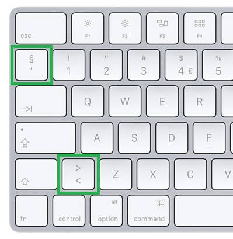
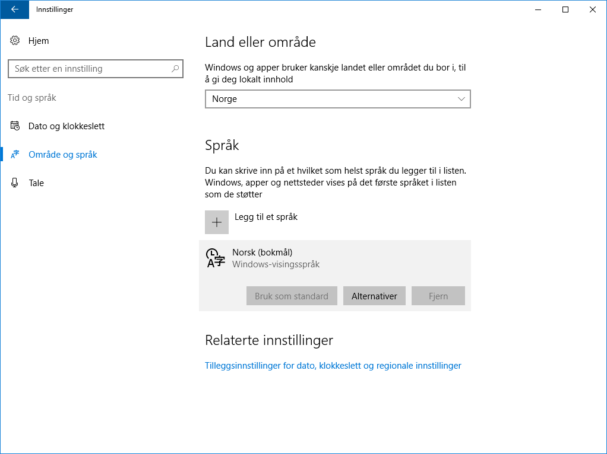

# Norsk layout for Apple Magic Keyboard og Windows 10

Jeg må bruke Windows 10, men vil bruke et Apple tastatur. Med drivere fra Apple så bytter to taster tegn, disse to:

Filene er laget og generert med [Microsoft Keyboard Layout Creator 1.4](https://msdn.microsoft.com/en-us/globalization/keyboardlayouts.aspx)

Du kan åpne [mggickeyboardfixed.klc](./mggickeyboardfixed.klc) i MKLC hvis du vil gjøre endringer eller verifisere layouten før du generer din egen installasjonspakke.

Kjør `magicfix/setup.exe` for å installere driverne (krever admin-rettigheter). Etter en omstart (kanskje det holder å logge av og på?), kan du installere det nye tastaturet: `Innstillinger` → `Tid og språk` → `Område og språk` → `Norsk bokmål` → `Alternativer` → `Legg til et tastatur`.

Den nye layouten vises som _Norsk (Apple) - Custom_ i listen.

